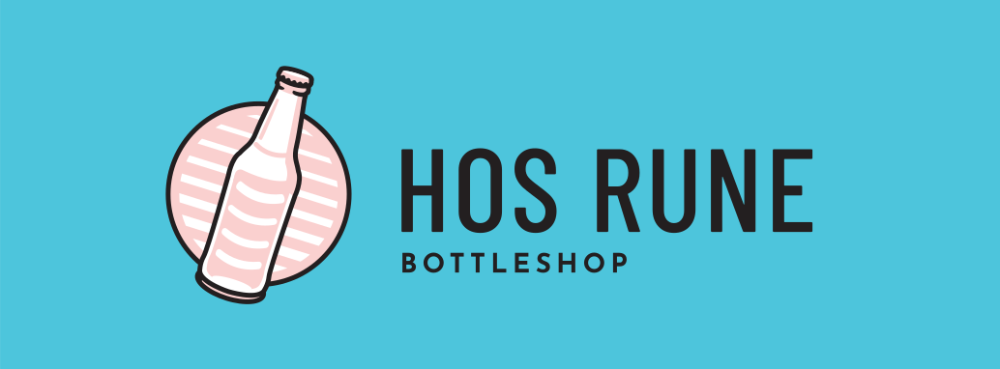

[](logo.svg)

# shopitappd

[](https://coveralls.io/github/RichardOberdieck/shopitappd?branch=main)

This repo integrates [Shopify](https://www.shopify.com/) and [Untappd](https://untappd.com/) for the [Hos Rune](https://hos-rune.dk/) bottleshop.

## Installation
The project uses [hatch](https://hatch.pypa.io/) as a build system, so after creating a virtual env (optional), get started by running `hatch run shopitappd` to execute the scripts, or `hatch run tests` to run the test suite.

## Usage
Currently, the repo covers two things:
1. Add a tag `"4+"` to all products which have a `>= 4` rating on Untappd.
2. Update the rating metafields on Shopify with the ratings from Untappd.

To run the code, execute:

```
hatch run shopitappd
```

The repo is currently set up to run as a cron job using Github Actions. See the corresponding [.yml file](./.github/workflows/schedule.yml) for details.

## How it works

### Background
Even though Untappd has the ISBN information for the beers available (this is what they use in their scanner in the app), this is not made available via the API.

Because the ISBN is not available, we need to find a different way to identify the beers. Each beer on Untappd has an "Untappd ID" (or `uid`), which you can retrieve from the URL:
```
https://untappd.com/b/<beer-name>/<uid>
```

This means, we need to find a mapping between the `uid` and the `product_id` on Shopify side.

### On the Shopify side
In our Shopify store, we have added a tag with `uid_<uid-number>` for each of our beers. So whenever we add a new beer, we simply look up the `uid` and add it as a tag.

> It is probably possible to build a web scraper to do this automatically. You're welcome to have a go at this, I think I will do it if Untappd removes API access from the Untappd for Business subscription (or hides it behind a paywall).

### On the Untappd side
We have made a menu called ["The Entire Beer Menu"](https://untappd.com/v/hos-rune-bottleshop/11402369?menu_id=134834), which we use to look-up all the beers.

## How to adapt to your own project
To run this for your own shop, you need to do a few things:
1. You need to register as a developer in your Shopify store, and retrieve a `SHOPIFY_ACCESS_TOKEN`. This token needs read/write access for products.
2. An `UNTAPPD_ACCESS_TOKEN`, which you get from the Untappd for Business part of the website. Ours looks like `"Basic cml..."`.
3. A `UNTAPPD_MENU_ID`, which refers to a menu on your Untappd store. 

In the code, the access tokens are injected as environment variables in the Github Actions and are stored as secrets. The `UNTAPPD_MENU_ID` is stored in the [constants.py](./shopitappd/constants.py).